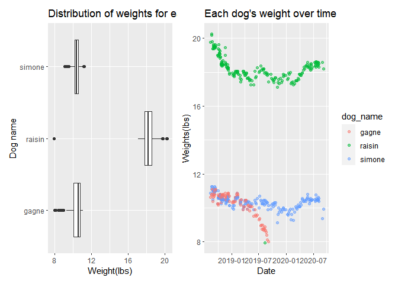

Midterm Project
================

``` r
library(tidyverse)
```

    ## -- Attaching packages --------------------------------------------------------------------------------- tidyverse 1.3.0 --

    ## v ggplot2 3.3.2     v purrr   0.3.4
    ## v tibble  3.0.3     v dplyr   1.0.2
    ## v tidyr   1.1.2     v stringr 1.4.0
    ## v readr   1.3.1     v forcats 0.5.0

    ## -- Conflicts ------------------------------------------------------------------------------------ tidyverse_conflicts() --
    ## x dplyr::filter() masks stats::filter()
    ## x dplyr::lag()    masks stats::lag()

``` r
library(readxl)
library(patchwork)
```

# Problem 1

The raw dataset contains weight data of three dogs, Raisin, Simone, and
Gagne, per date ranging from 8/12/2018 to 9/7/2020. Each dog has two
weight entries- weight in pounds and in ounces. The raw dataset also
contains notes and weight data of a standard object that was weighed to
ensure accuracy over time.

The goals of this report are to examine the distribution of weights for
each dog and the progression of each dog’s weight over time.

### (1) Tidy raw dataset

``` r
dogs_raw = 
  read_excel("./data/dogweights.xlsx", range = "B2:G207", col_types = c("date", "text", "text", "text", "text",
  "text")) %>%
  rename(notes = ...6) %>%
  janitor::clean_names()
```

    ## Warning in read_fun(path = enc2native(normalizePath(path)), sheet_i = sheet, :
    ## Expecting date in B79 / R79C2: got 's'

    ## New names:
    ## * `` -> ...6

### (2) Produce first tidy dataframe

``` r
dogs_df1 = 
  dogs_raw %>%
  drop_na(date) %>%
  separate(date, into = c("year", "month", "day"), sep = "-") %>%
  mutate(raisin = recode(raisin, '1810' = '18 10', '1803' = '18 03', '7 15' = '17 15')) %>%
  separate(raisin, into = c("raisinlbs", "raisinoz"), sep = " ") %>%
  mutate(raisin = as.numeric(raisinlbs) + as.numeric(raisinoz)/16) %>%
  separate(simone, into = c("simonelbs", "simoneoz"), sep = " " ) %>%
  mutate(simone = as.numeric(simonelbs) + as.numeric(simoneoz)/16) %>%
  separate(gagne, into = c("gagnelbs", "gagneoz"), sep = " " ) %>%
  mutate(gagne = as.numeric(gagnelbs) + as.numeric(gagneoz)/16) %>%
  mutate(
    year = as.factor(year),
    month = as.factor(month),
    day = as.factor(day)) %>%
  select(-c(raisinlbs:notes))
```

One of the issues of the imported raw dataset was the incorrect date
formatting. So, I used ‘col\_types’ to fix the issue. Additionally, the
columns were named incorrectly in the imported raw dataset. Thus, I set
the import range of the raw data excel sheet to exclude the first row,
and then renamed one of the columns, and used ‘clean\_names()’. Then, I
used ‘mutate’ and ‘recode’ to fix errors in three of Raisin’s weight
entries. I then used ‘separate’ and ‘mutate’ to combine the two weight
data into one weight data(lbs) per dog. Finally, I produced the first
tidy dataframe by using ‘select’ to leave out unnecessary columns.

### (3) Produce second tidy dataframe

``` r
dogs_df2 = 
  dogs_raw %>%
  drop_na(date) %>%
  separate(date, into = c("year", "month", "day"), sep = "-") %>%
  mutate(
    year = as.factor(year),
    month = as.factor(month),
    day = as.factor(day)) %>%
  select(-c(raisin:std))
```

### (4) Export both dataframes

``` r
write_csv(dogs_df1, "./data/problem1_dataframe1.csv")
write_csv(dogs_df2, "./data/problem1_dataframe2.csv")
```

# Problem 2

### (1) Identify the number of unique dates in the dataset

``` r
unique_days = 
  dogs_df1 %>%
  group_by(year, month, day) %>%
  summarize(n_obs = n()) %>%
  nrow()
```

    ## `summarise()` regrouping output by 'year', 'month' (override with `.groups` argument)

There are 204 unique dates in the dataset. Raisin’s maximum weight was
20.25 lbs and minimum weight was 17.125 lbs. In addition, Simone’s
maximum and minimum weights were 11.25 lbs and 9.125 lbs, respectively.
Lastly, Gagne’s maximum and minimum weights were 11.125 lbs and 8 lbs,
respectively.

### (2) Make a table

``` r
dogs_table = 
  data.frame(t(colSums(!is.na(dogs_df1)))) %>%
  select(raisin, simone, gagne)
rownames(dogs_table) = c("observations")

dogs_weight_mean = 
  dogs_df1 %>%
  summarize(
    raisin = mean(raisin, na.rm = TRUE),
    simone = mean(simone, na.rm = TRUE),
    gagne = mean(gagne, na.rm = TRUE))
rownames(dogs_weight_mean) = c("mean")
```

    ## Warning: Setting row names on a tibble is deprecated.

``` r
dogs_weight_sd = 
  dogs_df1 %>%
  summarize(
    raisin = sd(raisin, na.rm = TRUE),
    simone = sd(simone, na.rm = TRUE),
    gagne = sd(gagne, na.rm = TRUE))
rownames(dogs_weight_sd) = c("standard deviation")
```

    ## Warning: Setting row names on a tibble is deprecated.

``` r
dogs_table = do.call("rbind", list(dogs_table, dogs_weight_mean, dogs_weight_sd)) %>%
  knitr::kable(digits = 0.1)

dogs_table
```

|                    | raisin | simone | gagne |
| :----------------- | -----: | -----: | ----: |
| observations       |    201 |    192 |   119 |
| mean               |     18 |     10 |    10 |
| standard deviation |      1 |      0 |     1 |

# Problem 3

### Create a two-panel plot

``` r
dogs_df3 = 
  dogs_raw %>%
  drop_na(date) %>%
  mutate(raisin = recode(raisin, '1810' = '18 10', '1803' = '18 03', '7 15' = '17 15')) %>%
  pivot_longer(
    raisin:gagne, 
    names_to = "dog_name",
    values_to = "weights") %>%
  relocate(dog_name) %>%
  separate(weights, into = c("lbs", "oz"), sep = " ") %>%
  mutate(weight_in_lbs = as.numeric(lbs) + as.numeric(oz)/16) %>%
  select(-c(notes, std, lbs, oz,))

#Plot of distribution of weights for each dog 
dogs_weight_dist = 
  dogs_df3 %>%
  select(-date) %>%
  ggplot(aes(x = dog_name, y = weight_in_lbs, fill = dog_name)) + 
  geom_violin(alpha = 0.5) +
  stat_summary() +
  labs(
    title = "Distribution of weights per dog",
    x = "dog name", 
    y = "weights(lbs)")

#Plot of each dog's weight over time
dogs_weight_time =
  dogs_df3 %>%
  ggplot(aes(x = date, y = weight_in_lbs, color = dog_name)) +
  geom_point(alpha = 0.3) +
  labs(
    title = "Each dog's weight over time",
    x = "date",
    y = "weights(lbs)") +
   theme(axis.text.x = element_text(angle = 90, vjust = 0.5, hjust = 1))
  
dogs_weight_dist + dogs_weight_time
```

    ## Warning: Removed 100 rows containing non-finite values (stat_ydensity).

    ## Warning: Removed 100 rows containing non-finite values (stat_summary).

    ## No summary function supplied, defaulting to `mean_se()`

    ## Warning: Removed 100 rows containing missing values (geom_point).

<!-- -->

The left panel shows that the minimum and maximum weights of Raisin are
much higher than any of the weights of Gagne and Simone. Raisin’s
weights show a right-skewed distribution with a mean around 18 lbs.
However, Gagne’s weight distribution is left-skewed with a mean around
10 lbs. Similarly, Simone’s weight distribution also shows a mean around
10 lbs, but seems closer to approaching a normal distribution and has
less of a spread than Gagne’s weight distribution. It is apparent that
Gagne’s minimum weight is lower than that of Simone while their maximum
weights seem very similar.

The right panel shows that there was a dramatic decrease in Raisin’s
weights from August 2018 to January 2019. Then, Raisin’s weights have
stayed fairly consistent between January 2019 and March 2020 until they
showed a more increasing trend from March to September 2020. Simone’s
weights have stayed more consistent from August 2018 to September 2020.
Although the weights seemed to slightly decrease from August 2018 to
January 2019, from then on the weights stayed fairly consistent.
However, Gagne’s weights showed a clear decreasing trend from August
2018 to September 2019. The decrease in weights was more steep from
around April 2019 to September 2019, most likely related to Gagne’s
imminent death.

``` r
devtools::install_github("benmarwick/wordcountaddin", type = "source", dependencies = TRUE)
```

    ## WARNING: Rtools is required to build R packages, but is not currently installed.
    ## 
    ## Please download and install Rtools 4.0 from https://cran.r-project.org/bin/windows/Rtools/.

    ## Skipping install of 'wordcountaddin' from a github remote, the SHA1 (8c063135) has not changed since last install.
    ##   Use `force = TRUE` to force installation

``` r
wordcountaddin::text_stats("p8105_mtp_nc2894.Rmd")
```

    ## For information on available language packages for 'koRpus', run
    ## 
    ##   available.koRpus.lang()
    ## 
    ## and see ?install.koRpus.lang()

    ## 
    ## Attaching package: 'koRpus'

    ## The following object is masked from 'package:readr':
    ## 
    ##     tokenize

| Method          | koRpus      | stringi       |
| :-------------- | :---------- | :------------ |
| Word count      | 500         | 470           |
| Character count | 2884        | 2884          |
| Sentence count  | 26          | Not available |
| Reading time    | 2.5 minutes | 2.4 minutes   |
