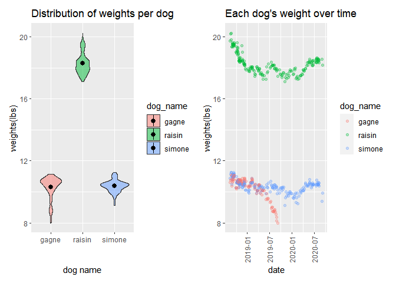

Midterm Project
================

``` r
library(tidyverse)
```

    ## -- Attaching packages ------------------------------------------------------------------------------------ tidyverse 1.3.0 --

    ## v ggplot2 3.3.2     v purrr   0.3.4
    ## v tibble  3.0.3     v dplyr   1.0.2
    ## v tidyr   1.1.2     v stringr 1.4.0
    ## v readr   1.3.1     v forcats 0.5.0

    ## -- Conflicts --------------------------------------------------------------------------------------- tidyverse_conflicts() --
    ## x dplyr::filter() masks stats::filter()
    ## x dplyr::lag()    masks stats::lag()

``` r
library(readxl)
library(patchwork)
```

# Problem 1

The raw dataset used in this project contains weight data of three pet
dogs, Raisin, Simone, and Gagne, per date which ranges from 8/12/2018 to
9/7/2020. Each dog has two weight entries- one of which is the weight in
pounds and the other is the weight in ounces. The raw dataset also
contains weight data of a standard object that was weighed occasionally
to ensure accuracy over time. In addition, occasional notes are included
in the raw dataset as well, which often mention the time periods the
dogs spent in a kennel.

The goals of this report is to examine the distribution of weights for
each dog and the progression of each dog’s weight over time.

(the different locations, such as kennels, the pet dogs were in during
certain time periods).

### (1) Tidy raw dataset

``` r
dogs_raw = 
  read_excel("./data/dogweights.xlsx", range = "B2:G207", col_types = c("date", "text", "text", "text", "text",
  "text")) %>%
  rename(notes = ...6) %>%
  janitor::clean_names()
```

    ## Warning in read_fun(path = enc2native(normalizePath(path)), sheet_i = sheet, :
    ## Expecting date in B79 / R79C2: got 's'

    ## New names:
    ## * `` -> ...6

### (2) Produce the first tidy dataframe

``` r
dogs_df1 = 
  dogs_raw %>%
  drop_na(date) %>%
  separate(date, into = c("year", "month", "day"), sep = "-") %>%
  mutate(raisin = recode(raisin, '1810' = '18 10')) %>%
  separate(raisin, into = c("raisinlbs", "raisinoz"), sep = " ") %>%
  mutate(raisin = as.numeric(raisinlbs) + as.numeric(raisinoz)/16) %>%
  separate(simone, into = c("simonelbs", "simoneoz"), sep = " " ) %>%
  mutate(simone = as.numeric(simonelbs) + as.numeric(simoneoz)/16) %>%
  separate(gagne, into = c("gagnelbs", "gagneoz"), sep = " " ) %>%
  mutate(gagne = as.numeric(gagnelbs) + as.numeric(gagneoz)/16) %>%
  mutate(
    year = as.factor(year),
    month = as.factor(month),
    day = as.factor(day)) %>%
  select(-c(raisinlbs:notes))
```

    ## Warning: Expected 2 pieces. Missing pieces filled with `NA` in 1 rows [116].

The raw dataset had some organization issues, so some steps were taken
to tidy and clean the data.

One of the issues was that the date formatting in the imported raw data
was incorrect. So, I used the ‘col\_types’ function to specify which
types of data each column in the imported dataset should have. Another
issue was that the columns were named as ‘Weight (Lbs Oz)’, ‘…2’, ‘…3’,
‘…4’, ‘…5’, and ‘notes’ in the imported raw dataset. In order to fix
this problem, I set the import range of the raw data excel sheet so that
it excludes the first row in the raw dataset, and then renamed one of
the columns to indicate ‘notes’, and used the ‘clean\_names()’ function
to clean the variable names.

After the initial tidying of the data, I noticed that the weight entries
for Raisin on 2018-10-22 did not have a space between the pounds entry
and the ounce entry. So, I used the ‘mutate’ and ‘recode’ functions to
create a spacing between these two entries. Then, I used the ‘separate’
function to create separate columns for each weight entry per dog, which
resulted in two columns per dog in the dataset. I then used the ‘mutate’
function to create a new column for each dog that combines the two
weight data per dog to one weight data per dog.

After doing so, I produced the first tidy dataframe by using the
‘select’ function to leave out unnecessary columns, such as ‘std’,
‘notes’, and all the two columns per dog. The ‘std’ column was
considered unnecessary because its mere purpose was to indicate the
accuracy of the dedicated scale over time, and the consistent data in
this column proved so. The ‘notes’ column was also left out because the
first tidy dataframe was intended not to include the notes.

### (3) Produce the second tidy dataframe that contains only the notes and dates

``` r
dogs_df2 = 
  dogs_raw %>%
  drop_na(date) %>%
  separate(date, into = c("year", "month", "day"), sep = "-") %>%
  mutate(
    year = as.factor(year),
    month = as.factor(month),
    day = as.factor(day)) %>%
  select(-c(raisin:std))
```

### (4) Export both dataframes as CSVs

``` r
write_csv(dogs_df1, "./data/problem1_dataframe1.csv")
write_csv(dogs_df2, "./data/problem1_dataframe2.csv")
```

# Problem 2

### (1) Identify the number of unique dates in the dataset

``` r
unique_days = 
  dogs_df1 %>%
  group_by(year, month, day) %>%
  summarize(n_obs = n()) %>%
  nrow()
```

    ## `summarise()` regrouping output by 'year', 'month' (override with `.groups` argument)

There are 204 unique dates in the tidy dataset.

### (2) Make a well-formatted table that shows the number of observations per dog, their average weight, and standard deviation

``` r
dogs_table = 
  data.frame(t(colSums(!is.na(dogs_df1)))) %>%
  select(raisin, simone, gagne)
rownames(dogs_table) = c("observations")

dogs_weight_mean = 
  dogs_df1 %>%
  summarize(
    raisin = mean(raisin, na.rm = TRUE),
    simone = mean(simone, na.rm = TRUE),
    gagne = mean(gagne, na.rm = TRUE))
rownames(dogs_weight_mean) = c("mean")
```

    ## Warning: Setting row names on a tibble is deprecated.

``` r
dogs_weight_sd = 
  dogs_df1 %>%
  summarize(
    raisin = sd(raisin, na.rm = TRUE),
    simone = sd(simone, na.rm = TRUE),
    gagne = sd(gagne, na.rm = TRUE))
rownames(dogs_weight_sd) = c("standard deviation")
```

    ## Warning: Setting row names on a tibble is deprecated.

``` r
dogs_table = do.call("rbind", list(dogs_table, dogs_weight_mean, dogs_weight_sd)) %>%
  knitr::kable(digits = 0.1)

dogs_table
```

|                    | raisin | simone | gagne |
| :----------------- | -----: | -----: | ----: |
| observations       |    200 |    192 |   119 |
| mean               |     18 |     10 |    10 |
| standard deviation |      1 |      0 |     1 |

# Problem 3

### Create a two-panel plot

``` r
dogs_df3 = 
  dogs_raw %>%
  drop_na(date) %>%
  pivot_longer(
    raisin:gagne, 
    names_to = "dog_name",
    values_to = "weights") %>%
  relocate(dog_name) %>%
  separate(weights, into = c("lbs", "oz"), sep = " ") %>%
  mutate(weight_in_lbs = as.numeric(lbs) + as.numeric(oz)/16) %>%
  select(-c(notes, std, lbs, oz,))
```

    ## Warning: Expected 2 pieces. Missing pieces filled with `NA` in 2 rows [118,
    ## 346].

``` r
#Plot of distribution of weights for each dog 
dogs_weight_dist = 
  dogs_df3 %>%
  select(-date) %>%
  ggplot(aes(x = weight_in_lbs, fill = dog_name)) + 
  geom_density(alpha = 0.3, adjust = 0.5) +
  labs(
    title = "Distribution of weights for each dog",
    x = "Weight(lbs)", 
    y = "Density")

#Plot of each dog's weight over time
dogs_weight_time =
  dogs_df3 %>%
  ggplot(aes(x = date, y = weight_in_lbs, color = dog_name)) +
  geom_point(alpha = 0.3) +
  labs(
    title = "Each dog's weight over time",
    x = "Date",
    y = "Weights(lbs)") +
   theme(axis.text.x = element_text(angle = 90, vjust = 0.5, hjust = 1))
  
dogs_weight_dist + dogs_weight_time
```

    ## Warning: Removed 102 rows containing non-finite values (stat_density).

    ## Warning: Removed 102 rows containing missing values (geom_point).

<!-- -->
